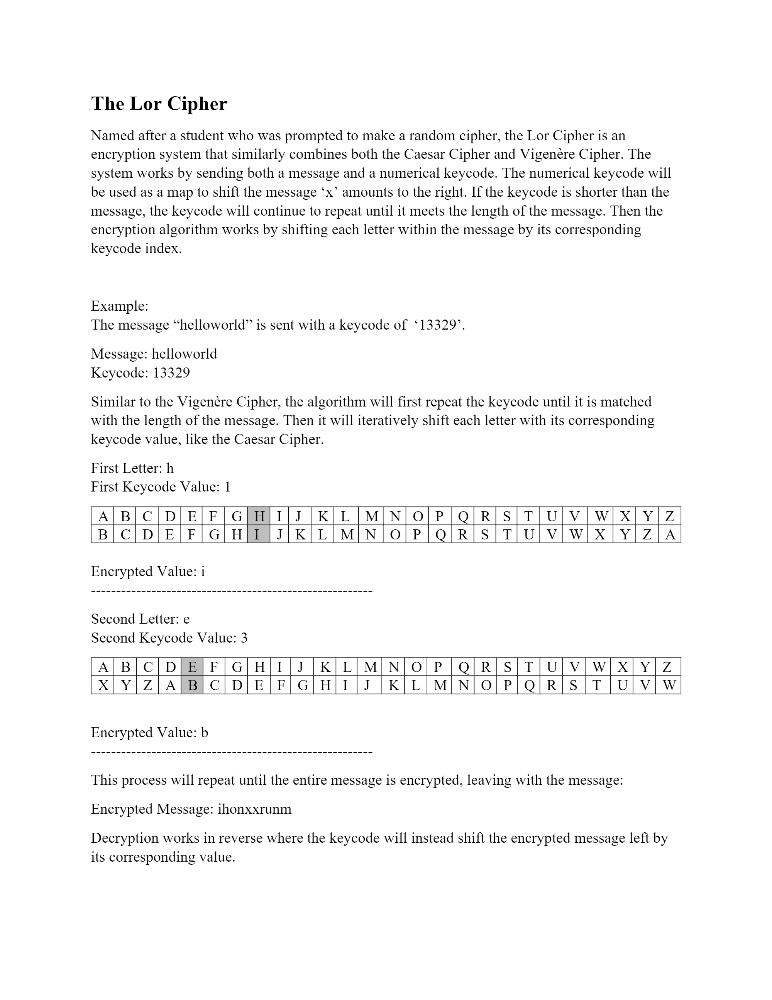

# CSC  1500 Project Three
This project was developed for my Fundamental Stuctures in Computer Science course at Wayne State.

##  Prompt
### This project revolves around the topic of **Encryption**.
- Write a Python program using the Caesar shift cipher to encrypt and decrypt a user-supplied word.  
- Write another substitution cipher but this time use the Vigenere cipher.  
- Make up your own algorithm for a substitution stream cipher, and make a creative name for it.  Diagram it using Microsoft Word, and then create a Python program to demonstrate.
  
## 💻 Custom Cipher

